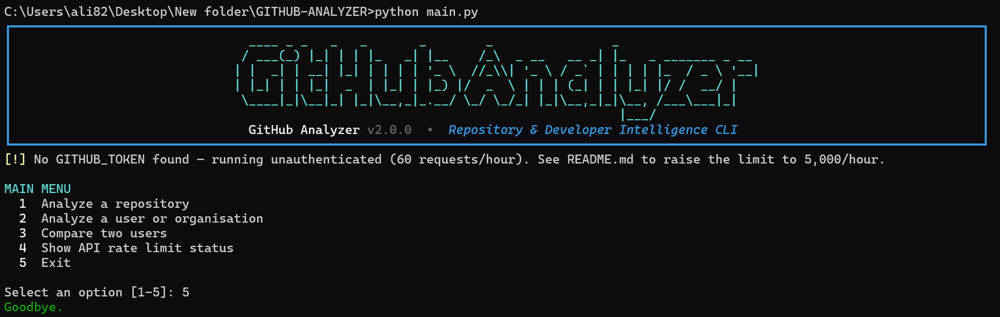
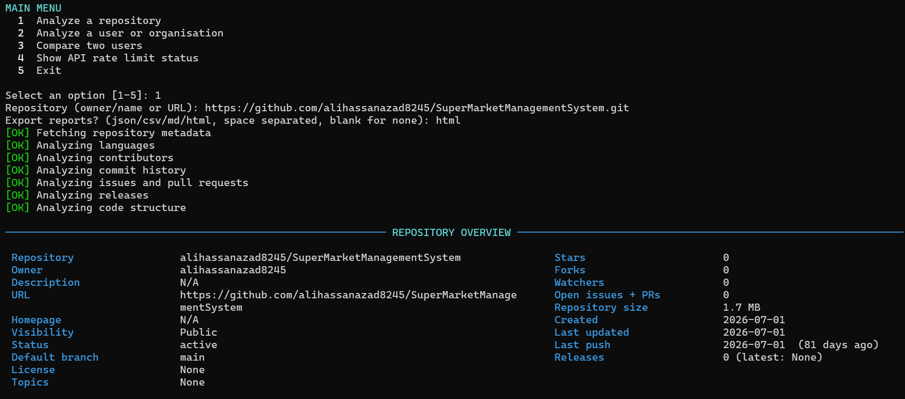
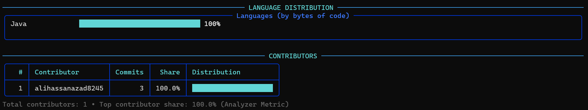
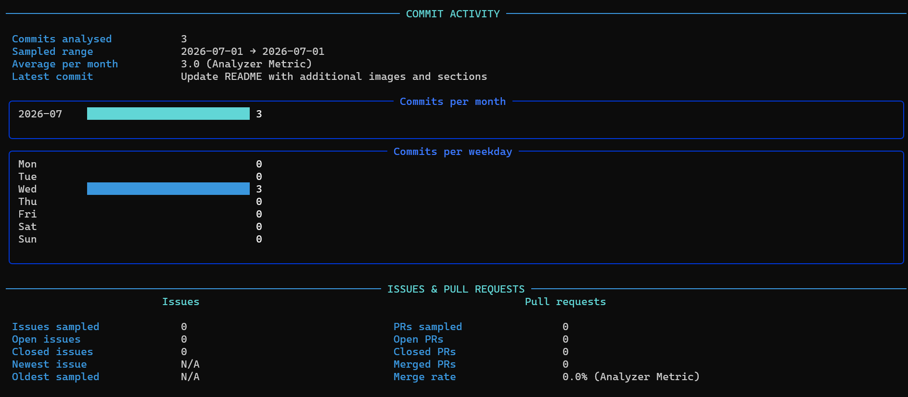
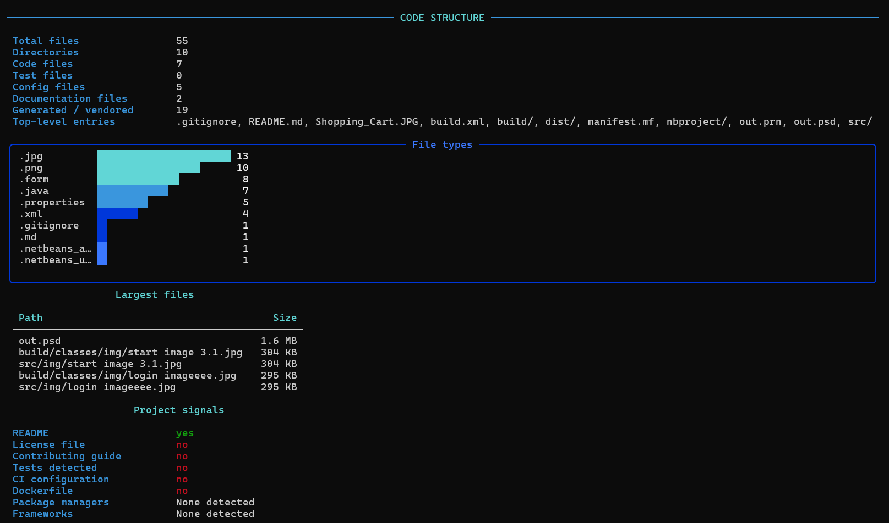
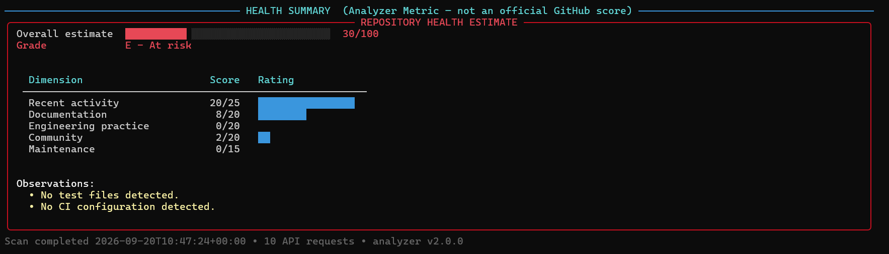
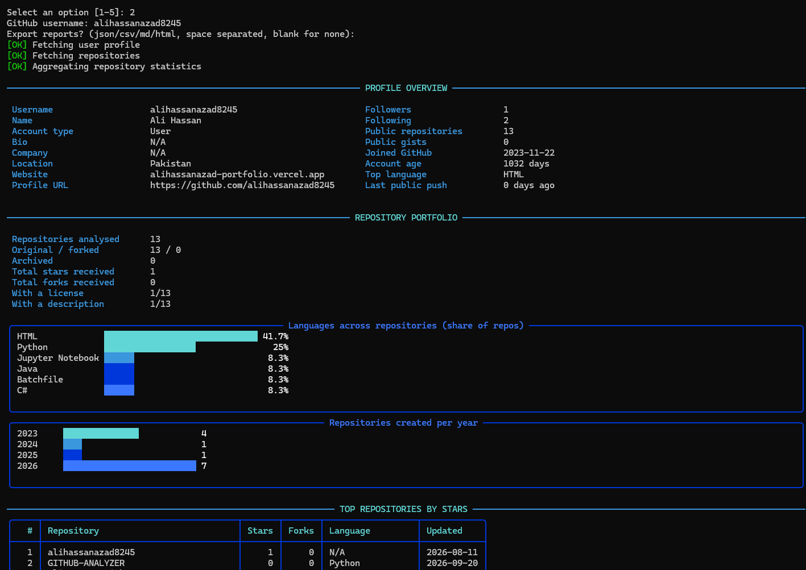
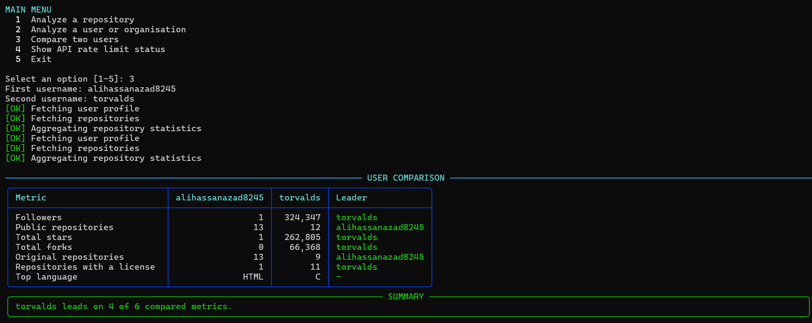
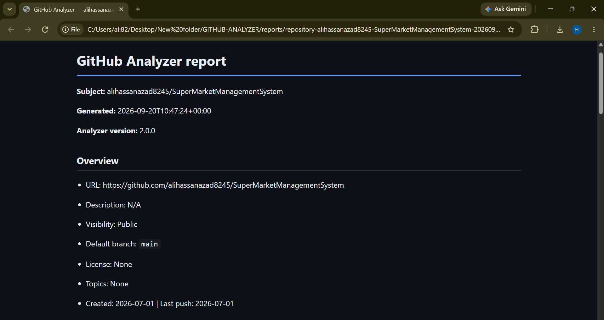

# GitHub Analyzer

A professional command-line tool that analyses **GitHub repositories and developer profiles**
using the GitHub REST API, and renders the results as a rich terminal dashboard.

No web server. No browser. No database. No Docker.
Just **Python + internet + `pip install -r requirements.txt`**.

<!-- SCREENSHOT 1 — BANNER + MAIN MENU
     Run: python main.py
     Capture the ASCII banner and the main menu. This is the hero image. -->



---

## Table of contents

- [Features](#features)
- [Requirements](#requirements)
- [Installation](#installation)
- [Usage](#usage)
- [GitHub token](#github-token)
- [Screenshots](#screenshots)
- [Reports](#reports)
- [Analyzer Metrics](#analyzer-metrics)
- [Project structure](#project-structure)
- [Tests](#tests)
- [Troubleshooting](#troubleshooting)
- [Limitations](#limitations)
- [License](#license)

---

## Features

### Repository analysis

- **Metadata** — description, URL, visibility, default branch, license, topics, size
- **Popularity** — stars, forks, watchers, open issues and pull requests
- **Timeline** — created, last updated, last push, days since the last push
- **Status flags** — archived, disabled, fork, private
- **Languages** — distribution by bytes of code with smooth Unicode bar charts
- **Contributors** — leaderboard with commit counts and share of contributions
- **Commits** — per-month and per-weekday activity, trend sparkline, top authors
- **Issues** — open/closed split, most used labels, newest and oldest
- **Pull requests** — open, closed, merged, and merge rate
- **Releases** — total count and the latest tag with its publication date
- **Code structure** — file and directory counts, code/test/config/docs breakdown,
  file-type distribution, largest files, vendored and generated file detection
- **Project signals** — README, LICENSE, CONTRIBUTING, tests, CI, Dockerfile,
  package managers and frameworks
- **Health estimate** — a 0–100 score with a coloured gauge and letter grade

### User and organisation analysis

- Profile: name, type, bio, company, location, website, account age
- Social: followers, following, public repositories, public gists
- Portfolio: total stars and forks received, original vs forked, archived count,
  licensing and description coverage
- Language distribution across all repositories
- Repositories created per year
- Top repositories ranked by stars

### Comparison

Side-by-side comparison of two users across followers, repositories, stars, forks,
original repositories, licensing and top language, with an overall leader summary.

### Exports

JSON, CSV, Markdown and self-contained HTML reports, plus optional PNG charts.

---

## Requirements

- Python 3.9 or newer
- An internet connection
- A GitHub token — **optional**, but recommended ([see below](#github-token))

---

## Installation

```bash
git clone https://github.com/alihassanazad8245/GITHUB-ANALYZER.git
cd GITHUB-ANALYZER
python -m venv .venv
```

Activate the virtual environment.

**Windows (PowerShell / CMD):**

```bash
.venv\Scripts\activate
```

**Linux / macOS:**

```bash
source .venv/bin/activate
```

Install the dependencies and run:

```bash
pip install -r requirements.txt
python main.py
```

---

## Usage

### Interactive mode

```bash
python main.py
```

You get a menu:

```
1  Analyze a repository
2  Analyze a user or organisation
3  Compare two users
4  Show API rate limit status
5  Exit
```

### Direct mode

```bash
# Analyse a repository
python main.py --repo alihassanazad8245/SuperMarketManagementSystem

# A full GitHub URL works too
python main.py --repo https://github.com/alihassanazad8245/SuperMarketManagementSystem.git

# Owner and name as separate flags
python main.py --owner alihassanazad8245 --name SuperMarketManagementSystem

# Analyse a profile
python main.py --user alihassanazad8245

# Compare two users
python main.py --compare alihassanazad8245 torvalds

# Export reports and PNG charts
python main.py --repo alihassanazad8245/SuperMarketManagementSystem --format json md html --charts

# Fast metadata-only scan (2 API requests)
python main.py --repo alihassanazad8245/SuperMarketManagementSystem --quick
```

### All options

| Option | Description |
| --- | --- |
| `--repo`, `-r` | Repository to analyse (`owner/name` or a GitHub URL) |
| `--owner` / `--name` | Repository owner and name as separate flags |
| `--user`, `-u` | GitHub user or organisation to analyse |
| `--compare`, `-c` | Compare two users |
| `--format`, `-f` | Export formats: `json`, `csv`, `md`, `html` (space separated) |
| `--output`, `-o` | Output directory for reports (default `./reports`) |
| `--charts` | Also export PNG charts (requires `matplotlib`) |
| `--quick` | Repository metadata only; skip commits, contributors and files |
| `--no-color` | Disable coloured output |
| `--token`, `-t` | GitHub token (prefer the `.env` file instead) |
| `--verbose`, `-v` | Verbose logging and full tracebacks |
| `--version` | Print the version and exit |
| `--help`, `-h` | Show help and exit |

---

## GitHub token

### Short answer

**The tool works without a token.** But you only get **60 requests per hour**, and one
full repository analysis costs about 10 requests — so roughly **5 analyses per hour**.

**Adding a token raises this to 5,000 requests per hour**, which is about 500 analyses.
This works for public data too: a token with **zero permissions still gets the full
5,000/hour limit**. There is no other way to raise the limit — GitHub fixes the
unauthenticated cap at 60/hour per IP address.

| | No token | With token |
| --- | :---: | :---: |
| Requests per hour | 60 | **5,000** |
| Full analyses per hour | ~5 | ~500 |
| Public repositories | Yes | Yes |
| Your private repositories | No | Yes |

### Setup in 4 steps

**Step 1 —** Open <https://github.com/settings/tokens/new>

**Step 2 —** Fill in the form:

- **Note:** `GitHub Analyzer`
- **Expiration:** 90 days (or whatever you prefer)
- **Scopes:** tick **nothing at all** — leave every checkbox empty.
  An empty token already gives you the full 5,000/hour for public data,
  and it is the safest kind of token you can create.
  *(Only tick `repo` if you want to analyse your own **private** repositories.)*

**Step 3 —** Click **Generate token** and copy it. GitHub shows it only once.

**Step 4 —** In the project folder, copy the template and paste your token in:

```bash
cp .env.example .env
```

Open `.env` and replace the placeholder:

```
GITHUB_TOKEN=ghp_paste_your_token_here
```

That's it. Run `python main.py` — it will confirm on startup:

```
[OK] Authenticated with GITHUB_TOKEN (4,998/5,000 API requests remaining)
```

`.env` is listed in `.gitignore`, so your token will **never** be committed or pushed.

### Alternatives to the `.env` file

**Environment variable** — Linux / macOS:

```bash
export GITHUB_TOKEN=ghp_paste_your_token_here
```

**Environment variable** — Windows PowerShell:

```powershell
$env:GITHUB_TOKEN = "ghp_paste_your_token_here"
```

**Command-line flag** (least secure — it is saved in your shell history):

```bash
python main.py --user alihassanazad8245 --token ghp_paste_your_token_here
```

Check your remaining quota any time with menu option **4**.

---

## Screenshots

### Repository overview

<!-- SCREENSHOT 2 — Run: python main.py --repo alihassanazad8245/SuperMarketManagementSystem
     Capture the REPOSITORY OVERVIEW section. -->



### Language distribution and contributors

<!-- SCREENSHOT 3 — Same command as above.
     Capture the LANGUAGE DISTRIBUTION chart and the CONTRIBUTORS table together. -->



### Commit activity

<!-- SCREENSHOT 4 — Same command.
     Capture COMMIT ACTIVITY, including the per-month bars and the trend sparkline. -->



### Code structure and project signals

<!-- SCREENSHOT 5 — Same command.
     Capture the CODE STRUCTURE section and the Project signals table. -->



### Repository health estimate

<!-- SCREENSHOT 6 — Same command.
     Capture the REPOSITORY HEALTH ESTIMATE panel with the coloured gauge. -->



### Profile analysis

<!-- SCREENSHOT 7 — Run: python main.py --user alihassanazad8245
     Capture PROFILE OVERVIEW and REPOSITORY PORTFOLIO. -->



### User comparison

<!-- SCREENSHOT 8 — Run: python main.py --compare alihassanazad8245 torvalds
     Capture the USER COMPARISON table and the SUMMARY panel. -->



### Exported HTML report

<!-- SCREENSHOT 9 — Run with --format html, then open the file from reports/ in a browser.
     Capture the rendered page. -->



---

## Reports

Exported files land in `reports/` (override with `--output`):

```
reports/
    repository-alihassanazad8245-SuperMarketManagementSystem-20260920-093709.json
    repository-alihassanazad8245-SuperMarketManagementSystem-20260920-093709.md
    repository-alihassanazad8245-SuperMarketManagementSystem-20260920-093709.html
    repository-alihassanazad8245-SuperMarketManagementSystem-20260920-093709.csv
```

| Format | Use it for |
| --- | --- |
| **JSON** | The complete structured report, ideal for further processing |
| **CSV** | A flat `field,value` table for spreadsheets |
| **Markdown** | Readable summary, good for pasting into an issue or a wiki |
| **HTML** | A self-contained page with light and dark styling — open it in any browser |
| **PNG** | Optional charts, rendered headlessly (`pip install matplotlib`) |

Reports never contain your token or any other secret.

---

## Analyzer Metrics

Some values are **computed by this tool**, not supplied by GitHub. They are always
labelled `Analyzer Metric` in the terminal and in exported reports:

- Repository health estimate (0–100 with a letter grade)
- Top contributor share (contribution concentration)
- Average commits per month
- Pull request merge rate

These are heuristics based on public signals. They are useful for comparison and
triage, but they are **not official GitHub scores**.

---

## Project structure

```
GITHUB-ANALYZER/
├── main.py                  # entry point: python main.py
├── requirements.txt         # dependencies
├── pytest.ini               # test configuration
├── .env.example             # token template (copy to .env)
├── .gitignore
├── README.md
├── LICENSE
├── reports/                 # generated output (git-ignored)
├── tests/
│   └── test_analyzer.py     # offline test suite
└── github_analyzer/
    ├── __init__.py          # version and app metadata
    ├── __main__.py          # python -m github_analyzer
    ├── cli.py               # arguments, interactive menu, orchestration
    ├── config.py            # settings, token resolution, API limits
    ├── errors.py            # typed exceptions for friendly error messages
    ├── github_client.py     # GitHub REST API client (pagination, caching)
    ├── analyzer.py          # analysis engine (no I/O, no rendering)
    ├── models.py            # typed report containers
    ├── ui.py                # terminal rendering and charts
    ├── reports.py           # JSON / CSV / Markdown / HTML exporters
    ├── charts.py            # optional PNG charts
    └── utils.py             # parsing, formatting, file classification
```

### Files you are most likely to change

| File | Change it to… |
| --- | --- |
| `github_analyzer/config.py` | adjust API limits, timeouts, default report folder |
| `github_analyzer/analyzer.py` | change health scoring weights or add an analysis |
| `github_analyzer/ui.py` | restyle the dashboard, banner, colours, chart widths |
| `github_analyzer/reports.py` | change report layout or add an export format |
| `github_analyzer/utils.py` | extend the file-type classification lists |
| `github_analyzer/cli.py` | add a command-line flag or a menu entry |

---

## Tests

```bash
pip install pytest
pytest
```

58 tests covering URL and username parsing, token resolution, HTTP error mapping,
every analysis function, report generation in all four formats, HTML escaping,
path-traversal safety and CLI argument parsing.

The suite is **fully offline** — the HTTP layer is faked — so it runs in under a
second and never consumes your API quota.

---

## Troubleshooting

**`ModuleNotFoundError: No module named 'rich'`**
Dependencies are not installed, or the virtual environment is not active.
Run `pip install -r requirements.txt`.

**`GitHub API rate limit reached`**
You have used the 60 unauthenticated requests allowed per hour. Either wait for the
reset time shown in the message, or [add a token](#github-token) for 5,000/hour.

**`Repository was not found`**
Check the owner and repository spelling. If it is private you need a token with the
`repo` scope. The repository may also have been renamed or deleted.

**`GitHub rejected the supplied token (401)`**
The token is invalid, expired or revoked. Generate a new one at
<https://github.com/settings/tokens>.

**`Could not reach api.github.com`**
Check your internet connection and any proxy or firewall blocking HTTPS to GitHub.

**PNG charts are not generated**
`matplotlib` is optional. Run `pip install matplotlib` and re-run with `--charts`.

**Boxes and bars look broken**
Your terminal font lacks Unicode box-drawing characters. On Windows use Windows
Terminal rather than the legacy console, or run with `--no-color`.

**Numbers look lower than on github.com**
Commits, issues and pull requests are sampled so one analysis stays within about ten
API requests. Sampled sections say so in the NOTES panel.

---

## Limitations

- Commit, issue and pull-request analysis uses the most recent items
  (300 commits, 200 issues, 200 pull requests), not the entire history.
- GitHub truncates the file tree for very large repositories; the structure numbers
  are then reported as a lower bound.
- Lines of code are not counted. GitHub's API exposes bytes per language, not line
  counts, and counting lines would require cloning the repository.
- Private repositories require a token with the `repo` scope.
- The health estimate is a heuristic produced by this tool, not a GitHub metric.

---

## License

Released under the MIT License. See [LICENSE](LICENSE).

---

Built by [@alihassanazad8245](https://github.com/alihassanazad8245)

---

Built by **Ali Hassan** — [GitHub](https://github.com/alihassanazad8245) · [Instagram](https://instagram.com/ali_hassan8245)
